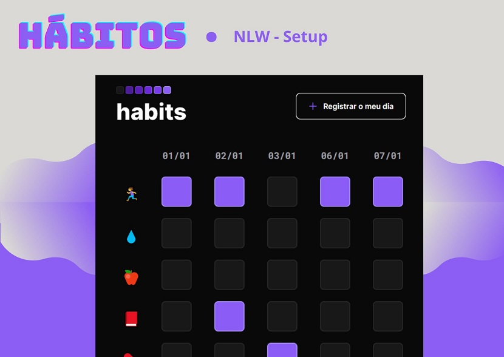

<h1 align="center">Hábitos</h1>

App de controle de hábitos criado durante o NLW, evento de tecnologia WEB promovido pela Rocketseat.

 <a href="#Tecnologias">Tecnologias</a> • 
 <a href="#Projeto">Projeto</a> • 
 <a href="#Layout">Layout</a> • 
 <a href="#Licença">Licença</a>

<h1 align="center">
  
</h1>

<h2>🚀Tecnologias</h2>

 Esse projeto foi desenvolvido com as seguintes tecnologias:
<ul>
  <li> HTML e CSS</li>
  <li> JavaScript</li>
  <li> Git e GitHub</li>
  <li> Figma</li>
  </ul>

<h2>💻Projeto</h2>

O Hábitos é um app para ajudar no monitoramento de novos hábitos.
<ul>
  <li>
    <a hrf="https://maykbrito.github.io/nlw-setup"> Visite o projeto online</a>
  </li>
</ul>

<h2>🔖Layout</h2>

Você pode visualizar o layout do projeto através desse 
  <a href="https://www.figma.com/community/file/1195327109778210238">LINK</a>
  . É necessário ter conta no
  <a href="https://figma.com">Figma</a>
  para acessá-lo.

<h2>📝Licença</h2>

Esse projeto está sob licença MIT.

